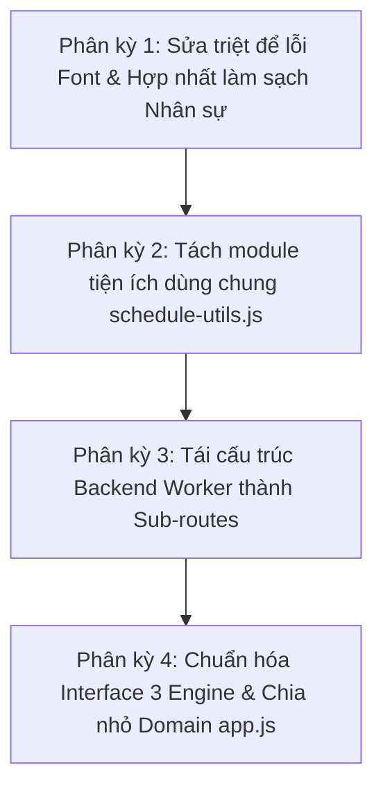

# 📋 KẾ HOẠCH TỔNG THỂ TỐI ƯU HÓA & GIẢN LƯỢC KIẾN TRÚC PM-XEPLICH V4

*Tài liệu quy hoạch kỹ thuật dài hạn cho dự án PM-XepLich v4 (Multi-Tenant SaaS).*  
*Ngày khởi tạo: 23/09/2026*  
*Mã phiên bản khởi đầu: v4.1.4*  

---

## 🎯 BỐI CẢNH & MỤC TIÊU CỐT LÕI

Hệ thống PM-XepLich v4 hiện đang vận hành ổn định trên nền tảng Cloudflare Pages + Worker API + Turso DB (libSQL Tokyo) & MiniPC. Tuy nhiên qua rà soát thực tế mã nguồn, hệ thống bộc lộ hai nhóm vấn đề lớn:
1. **Lỗi hiển thị cục bộ (Font tiếng Việt):** Bộ giải mã `decodeVietnameseEncoding` và `cleanAndHealPatientName` mới chỉ áp dụng cho Tên bệnh nhân và Tên thủ thuật, trong khi Tên nhân sự (`nvChinh`, `nvPhu`) bị bỏ qua, dẫn đến rác ký tự khi đọc dữ liệu HIS cũ; cơ chế chữa lành từ điển họ bị hard-code; hàm `cleanStaffStr` bị copy-paste 3 nơi.
2. **Quy mô file khổng lồ (Monolithic files) & Trùng lặp thuật toán:**
   - `js/app.js`: ~17.700 dòng
   - `backend/src/index.js`: ~6.340 dòng
   - `js/thongke.js`: ~3.739 dòng
   - `js/scheduler-engine.js`: ~3.669 dòng
   - 3 engine xếp lịch song song (`SchedulerEngine`, `MedicalCPSolver`, `AIScheduler`) đều tự định nghĩa lại các hàm tiện ích (`t2m`, `m2t`, `isOverlap`...).

Kế hoạch tái cấu trúc được chia làm **4 Phân kỳ** thực thi tuần tự, đảm bảo không làm gián đoạn hệ thống đang chạy của khách hàng và tuân thủ 100% [RULES.md](file:///c:/PRIVATE-DPT/PM-DPT/PM-xeplich/PM-chinh/ban_web/v4-thuongmai/RULES.md).

---

## 🗺️ LỘ TRÌNH 4 PHÂN KỲ CHI TIẾT



---

### 🔹 PHÂN KỲ 1: Khắc phục triệt để lỗi Font & Hợp nhất làm sạch Nhân sự
*Mục tiêu: Giải quyết ngay điểm nghẽn hiển thị rác ký tự tên nhân sự, chuẩn hóa pipeline đọc file HIS và loại bỏ copy-paste hàm làm sạch.*

1. **Xây dựng hàm `cleanAndHealStaffName(rawStaff, candidates)`:**
   - Chạy qua `decodeVietnameseEncoding(rawStaff)` để khôi phục TCVN3/VNI/Unicode tổ hợp/mojibake.
   - Chuẩn hóa loại bỏ khoảng trắng thừa, đưa về dạng Title Case chuẩn tiếng Việt.
   - Đối chiếu thông minh với danh mục nhân sự chuẩn (`candidates`: lấy từ `dataCache.staff` trên UI hoặc `database.staff` trong engine). Nếu sau khi loại bỏ tiền tố (`bs`, `ktv`, `đd`, `dd`, `bác sĩ`) mà khớp không dấu với nhân sự nào trong danh mục, tự động phục hồi tên chính xác 100% theo danh mục khoa/phòng.
2. **Áp dụng vào Pipeline Xếp lịch & Render Bảng lịch:**
   - Trong `js/scheduler-engine.js`: cập nhật hàm `normalizeScheduleItem()` cho cả `nvChinh` và `nvPhu` đi qua `cleanAndHealStaffName()`.
   - Trong `js/app.js`: tại các vị trí in ra thẻ `<td>${item.nvChinh}</td>` và `<td>${item.nvPhu}</td>` (dòng ~7095, ~8288...), bọc hiển thị an toàn.
3. **Quy tụ `cleanStaffStr` về một bản duy nhất:**
   - Đặt một bản chuẩn duy nhất tại `SchedulerEngine.cleanStaffStr` và xuất bản ra `window.cleanStaffStr`.
   - Thay thế các đoạn code copy-paste tại `scheduler-engine.js` (dòng 522, 1833) và `cp-solver.js` (dòng 242).
4. **Chuẩn hóa đọc dữ liệu Excel HIS trong `importFromHIS()`:**
   - Trong `app.js:11272`, ép toàn bộ các ô text từ sheet Excel qua `decodeVietnameseEncoding` ngay từ bước đọc thô (raw row), ngăn chặn mã lỗi lan sâu vào bộ nhớ.

---

### 🔹 PHÂN KỲ 2: Tách module tiện ích dùng chung `js/schedule-utils.js`
*Mục tiêu: Triệt tiêu code trùng lặp giữa 3 engine xếp lịch và app.js, tạo nền tảng dùng chung tin cậy.*

1. **Khởi tạo `js/schedule-utils.js`:**
   - Di chuyển các hàm xử lý thời gian: `t2m(timeStr)`, `m2t(minutes)`, `isEmptyTime(val)`, `is_overlap(start1, end1, start2, end2)`.
   - Di chuyển các hàm bảng mã & chuỗi tiếng Việt: `decodeVietnameseEncoding(str)`, `toVietnameseProperCase(str)`, `stripTones(str)`, `cleanStaffStr(str)`.
   - Di chuyển các hàm làm sạch & chữa lành: `cleanAndHealPatientName()`, `cleanAndHealProcedureName()`, `cleanAndHealStaffName()`.
2. **Tích hợp vào toàn bộ hệ sinh thái:**
   - Nạp `js/schedule-utils.js` trong `index.html` trước các file engine và `app.js`.
   - Thêm vào danh sách Static Assets của Service Worker `sw.js`.
   - Rút gọn định nghĩa trùng lặp trong `scheduler-engine.js`, `cp-solver.js`, `ai-scheduler.js` và `app.js`.

---

### 🔹 PHÂN KỲ 3: Tái cấu trúc Backend Worker thành các Sub-routes Module
*Mục tiêu: Chia nhỏ file `backend/src/index.js` (6.340 dòng) thành các domain riêng biệt, dễ đọc, dễ kiểm thử và bảo trì.*

1. **Cấu trúc thư mục mới trong `backend/src/`:**
   - `backend/src/routes/staff.js`: API quản lý nhân sự, danh mục kỹ năng, phân công.
   - `backend/src/routes/patients.js`: API quản lý bệnh nhân, đợt điều trị, chỉ định thủ thuật.
   - `backend/src/routes/schedules.js`: API lưu/đọc/khóa lịch, đồng bộ lịch khám.
   - `backend/src/routes/tenants.js`: Quản trị đa đơn vị (Super Admin), bản quyền, phân quyền phòng khám.
   - `backend/src/routes/backup-sync.js`: Đồng bộ Turso libSQL, MiniPC local proxy, export D1.
2. **Ràng buộc bất khả xâm phạm theo Rule 2:**
   - Mọi route SQL CRUD bắt buộc duy trì bộ lọc `WHERE unit_code = ?`.
   - Kiểm tra xác thực `x-unit-code` và quyền của token JWT trên từng sub-router.
   - `backend/src/index.js` chính chỉ đóng vai trò entrypoint: middleware CORS, Auth, Router Mounting (`app.route('/api/staff', staffRoutes)...`).

---

### 🔹 PHÂN KỲ 4: Chuẩn hóa Interface 3 Engine & Chia nhỏ Domain Frontend `app.js`
*Mục tiêu: Đóng gói 3 thuật toán xếp lịch theo mẫu Pluggable Strategy và module hóa Frontend 17.700 dòng.*

1. **Chuẩn hóa Pluggable Strategy cho 3 Engine Xếp lịch:**
   - Thiết kế chung một interface `ISchedulerEngine`:
     ```javascript
     executeSchedule(scheduleContext) => { success, schedule, unscheduled, stats }
     ```
   - Cho phép người dùng chuyển đổi linh hoạt giữa:
     - Strategy 1: `SimulatedAnnealingEngine` (`scheduler-engine.js`) - Tối ưu phân bổ tài nguyên phức hợp, đa luồng Web Worker.
     - Strategy 2: `ConstraintProgrammingEngine` (`cp-solver.js`) - Ràng buộc cứng, Branch & Bound.
     - Strategy 3: `AIPatternEngine` (`ai-scheduler.js`) - Xếp lịch nhanh theo tiền lệ học máy.
2. **Chia nhỏ `js/app.js` thành các domain script (ES Modules hoặc Namespace scripts):**
   - `js/modules/app-his-import.js`: Nhập dữ liệu y lệnh HIS, ánh xạ thủ thuật, đọc file Excel.
   - `js/modules/app-export.js`: Xuất Excel, in ấn, xuất báo cáo PDF Make.
   - `js/modules/app-grid-renderer.js`: Vẽ bảng lịch lưới, kéo thả ca, hiển thị timeline Gantt.
   - `js/modules/app-tenant-admin.js`: Giao diện quản trị Super Admin / Quản lý đơn vị.
   - `js/app.js`: Core controller liên kết state, nạp dữ liệu và xử lý vòng đời ứng dụng.

---

## 🔒 NGUYÊN TẮC BẢO ĐẢM THEO [RULES.MD](file:///c:/PRIVATE-DPT/PM-DPT/PM-xeplich/PM-chinh/ban_web/v4-thuongmai/RULES.md)

1. **Rule 1 (Syntax Check):** Mọi bước sửa đổi đều phải vượt qua `node -c js/init.js && node -c js/app.js && node -c js/scheduler-engine.js && node -c backend/src/index.js`.
2. **Rule 2 (Tenant Clamping):** Không bao giờ làm lỏng ràng buộc `unit_code`.
3. **Rule 3 (Versioning):**
   - Phiên bản chính chỉ tăng 1 số mỗi ngày mới (`4.1.3` -> `4.1.4`).
   - Cập nhật số revision `revN` trong ngày trên `version.json`, Cache Buster `index.html` và `sw.js`.
   - Footer `#app-footer-version` chỉ hiển thị phiên bản chính (`Phiên bản: 4.1.4`), không kèm `revN`.
4. **Rule 4 & 5 (Deploy & Git):** Chạy lệnh deploy Cloudflare và push git main kèm commit rõ ràng.
5. **Rule 6 (Log):** Cập nhật chi tiết kết quả thực hiện vào [PM-xeplich-v4.md](file:///c:/PRIVATE-DPT/PM-DPT/PM-xeplich/PM-chinh/ban_web/v4-thuongmai/PM-xeplich-v4.md).
