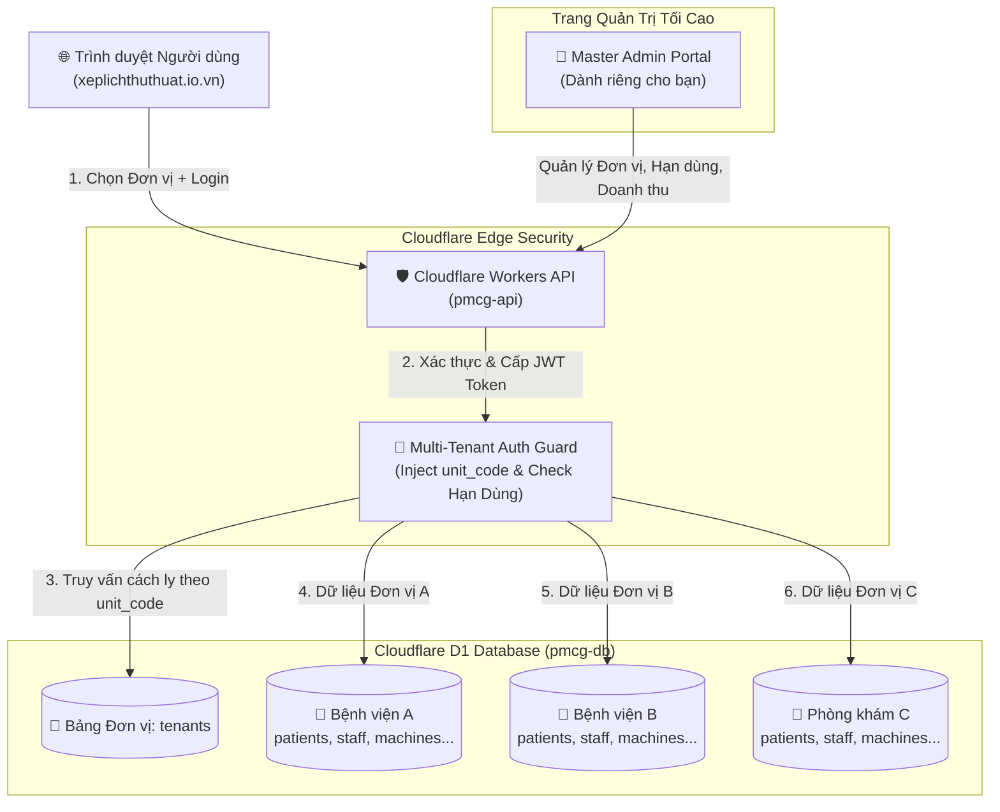

# 🏥 KẾ HOẠCH CHI TIẾT THƯƠNG MẠI HÓA HỆ THỐNG PM-XEPLICH V3 (MULTI-TENANT SAAS)

> [!IMPORTANT]
> **Mục tiêu cốt lõi**:
> 1. Duy trì duy nhất **1 tên miền chính thức**: `https://www.xeplichthuthuat.io.vn` (Cloudflare Pages).
> 2. Người dùng chỉ cần **Chọn Đơn vị (Cơ sở y tế)** tại màn hình Đăng nhập để vào không gian làm việc độc lập của mình.
> 3. **Cách ly dữ liệu 100%**: Tuyệt đối không rò rỉ dữ liệu giữa các Bệnh viện/Phòng khám.
> 4. Tích hợp hệ thống **Quản lý Bản quyền / Hạn sử dụng (Subscription License)** và **Cổng Super Admin** dành cho chủ sở hữu phần mềm để cấp mới, gia hạn, khóa/mở đơn vị.
> 5. Giữ nguyên ưu thế: Tốc độ phản hồi 10 - 25ms, chi phí hạ tầng Cloudflare Serverless gần như **0 VNĐ / tháng**.

---

## 🏛️ Sơ Đồ Kiến Trúc Multi-Tenant Tổng Thể



---

## 📋 Lộ Trình Triển Khai 5 Giai Đoạn (Chi Tiết & Khả Thi)

---

### GIAI ĐOẠN 1: TÁI CẤU TRÚC DATABASE CLOUDFLARE D1 (MULTI-TENANT SCHEMA)

> [!NOTE]
> Áp dụng mô hình **Shared Database - Row-Level Tenant Clamping**. Toàn bộ 16 bảng dữ liệu đều được gắn thêm trường định danh `unit_code` (Mã đơn vị) và lập Index tăng tốc truy vấn.

#### 1. Thêm Bảng Quản Lý Đơn Vị & Bản Quyền (`tenants`)
Tạo bảng mới chuyên biệt quản lý thông tin các cơ sở y tế khách hàng:
```sql
CREATE TABLE IF NOT EXISTS tenants (
    id INTEGER PRIMARY KEY AUTOINCREMENT,
    unit_code TEXT UNIQUE NOT NULL,       -- Ví dụ: 'BV_TKS', 'BV_YHCT_HN', 'PK_ANBINH'
    unit_name TEXT NOT NULL,              -- 'Bệnh viện Đa khoa Triệu Sơn'
    logo_url TEXT,                        -- Logo thương hiệu riêng của đơn vị
    phone TEXT,                           -- Số điện thoại liên hệ
    email TEXT,                           -- Email đại diện
    plan_tier TEXT DEFAULT 'PRO',         -- 'TRIAL', 'BASIC', 'PRO', 'ENTERPRISE'
    max_staff INTEGER DEFAULT 30,         -- Giới hạn số nhân sự theo gói
    max_patients INTEGER DEFAULT 150,     -- Giới hạn số bệnh nhân theo gói
    expires_at TEXT NOT NULL,             -- Ngày hết hạn bản quyền: '2027-12-31'
    is_active INTEGER DEFAULT 1,          -- 1: Đang hoạt động, 0: Đang bị khóa
    created_at DATETIME DEFAULT CURRENT_TIMESTAMP,
    updated_at DATETIME DEFAULT CURRENT_TIMESTAMP
);
CREATE UNIQUE INDEX idx_tenants_code ON tenants(unit_code);
```

#### 2. Thêm Cột `unit_code` Vào Toàn Bộ 15 Bảng Hiện Tại
Cập nhật file `backend/schema.sql` và chạy migration tự động bổ sung cột `unit_code`:
* `patients`, `staff`, `machines`, `rooms`, `procedures`, `phac_do`
* `history_records`, `history_busy`, `training_data`, `tim_ranh`
* `chamcong_records`, `thongke_records`, `accounts`, `cai_dat`, `documents`
* Mặc định dữ liệu hiện tại của bệnh viện bạn sẽ được gán `unit_code = 'BV_TKS'` (đảm bảo 100% không mất dữ liệu cũ).

---

### GIAI ĐOẠN 2: NÂNG CẤP BACKEND WORKER API (HONO MULTI-TENANT MIDDLEWARE)

> [!IMPORTANT]
> **Bảo mật tuyệt đối**: Xây dựng tầng Middleware chặn ở mọi API Endpoint. Người dùng của Bệnh viện A không bao giờ có thể đọc hoặc sửa dữ liệu của Bệnh viện B kể cả khi cố tình can thiệp Request.

#### 1. API Lấy Danh Sách Đơn Vị Public (`/api/getPublicUnits`)
* Trả về danh sách: `[{ unit_code: "BV_TKS", unit_name: "Bệnh viện Đa khoa Triệu Sơn", logo_url: "..." }, ...]` phục vụ hiển thị trên màn hình đăng nhập.
* Chỉ trả về các đơn vị có `is_active = 1`.

#### 2. Nâng Cấp Xác Thực Đăng Nhập (`checkLogin` / `verifyLogin`)
* Nhận 3 tham số: `unit_code`, `username`, `password`.
* **Kiểm tra 3 bước**:
  1. Đơn vị có tồn tại và đang kích hoạt không?
  2. Thời hạn bản quyền (`expires_at`) còn hạn hay đã hết hạn? (Nếu hết hạn: Trả về thông báo lỗi kèm số Hotline liên hệ gia hạn).
  3. Mật khẩu có khớp với tài khoản trong đơn vị đó không?
* Trả về **JWT Token có chữ ký bí mật** chứa `{ unit_code, username, role, expires_at }`.

#### 3. Middleware Tự Động Ràng Buộc Tenant (`tenantGuard`)
* Với mọi API mutation/query (`getBootstrapData`, `savePatients`, `saveStaff`, `addPhacDo`...):
  - Tự động bóc tách `unit_code` từ Token.
  - Tự động tiêm điều kiện `WHERE unit_code = ?` vào tất cả các câu lệnh SQL `SELECT`, `UPDATE`, `DELETE`, `INSERT`.

---

### GIAI ĐOẠN 3: NÂNG CẤP GIAO DIỆN WEB & MÀN HÌNH ĐĂNG NHẬP (FRONTEND)

#### 1. Thiết Kế Lại Form Đăng Nhập (`#modal-login`)
* Thêm ô chọn **🏢 Cơ Sở Y Tế / Bệnh Viện / Phòng Khám**:
  - Hỗ trợ cả **Dropdown chọn nhanh** và **Ô tìm kiếm gõ mã đơn vị**.
  - Tự động ghi nhớ đơn vị đã chọn lần trước trên trình duyệt người dùng (`localStorage['last_selected_unit']`).

#### 2. Tùy Biến Giao Diện Động Theo Đơn Vị (Dynamic White-labeling)
* Sau khi đăng nhập thành công:
  - Header hiển thị Tên & Logo riêng của Đơn vị đó (ví dụ: *"Bệnh viện Y Học Cổ Truyền ABC - Hệ Thống Xếp Lịch T.I.M.E.S"*).
  - Tự động chuyển đổi thông tin cấu hình phòng, danh mục máy, thủ thuật theo đơn vị.

#### 3. Tách Biệt Bộ Nhớ Đệm Offline (Offline Cache Isolation)
* Tách biệt các khóa LocalStorage và Dexie theo mã đơn vị:
  - `times_bootstrap_cache_${unit_code}`
  - `times_ai_learned_model_${unit_code}`
  - `meds_protocols_${unit_code}`
* Đảm bảo nếu 2 bác sĩ ở 2 bệnh viện khác nhau dùng chung 1 máy tính trình duyệt cũng không bao giờ bị dính cache của nhau.

---

### GIAI ĐOẠN 4: XÂY DỰNG CỔNG QUẢN TRỊ TỐI CAO (MASTER SUPER-ADMIN PORTAL)

> [!TIP]
> Xây dựng một giao diện quản trị riêng (chỉ tài khoản Chủ sở hữu / Bạn truy cập được qua role `SUPER_ADMIN`):

#### Các Tính Năng Trong Cổng Master Admin:
1. **Quản Lý Danh Sách Khách Hàng (Tenants)**:
   - ➕ **Tạo Đơn vị Mới (1-Click Onboarding)**: Nhập Mã đơn vị, Tên đơn vị, Số điện thoại -> Hệ thống tự động khởi tạo bộ danh mục mẫu (Thủ thuật YHCT, Phòng, Máy cơ bản) để khách hàng có thể dùng thử ngay lập tức.
   - ⏱ **Gia hạn Bản quyền**: Chọn gói (1 tháng, 3 tháng, 1 năm, Vĩnh viễn) hoặc chọn ngày hết hạn tùy ý.
   - 🔒 **Khóa / Kích hoạt Đơn vị**: Khóa tạm thời các đơn vị chưa thanh toán cước hoặc vi phạm điều khoản.
   - 🔑 **Reset Mật khẩu Admin Đơn vị**: Cấp lại mật khẩu quản trị cho khách hàng khi họ quên.
2. **Dashboard Thống Kê Kinh Doanh**:
   - Tổng số đơn vị đang hoạt động / sắp hết hạn trong 7 ngày tới.
   - Tổng số ca thủ thuật đã xếp trên toàn hệ thống trong tháng.
3. **Sao Lưu & Xuất Dữ Liệu Độc Lập**:
   - Nút **"📥 Export Toàn Bộ Dữ Liệu Đơn Vị Ra Excel/JSON"** để bàn giao dữ liệu khi hợp đồng kết thúc.

---

### GIAI ĐOẠN 5: ĐỊNH HÌNH GÓI CƯỚC & CHIẾN LƯỢC KINH DOANH (PRICING & PACKAGING)

| Gói Cước | Đối Tượng Mục Tiêu | Giới Hạn & Tính Năng | Mức Giá Đề Xuất |
| :--- | :--- | :--- | :--- |
| **Gói DÙNG THỬ (Trial)** | Các phòng khám / khoa mới tiếp cận | • Dùng thử full tính năng 14 - 30 ngày<br>• Tối đa 15 nhân sự, 50 bệnh nhân | **Miễn phí** |
| **Gói CƠ BẢN (Basic)** | Phòng khám YHCT/PHCN tư nhân quy mô vừa | • Dưới 15 KTV, 100 bệnh nhân/ngày<br>• Đầy đủ xếp lịch, chấm công, tìm rảnh | **500.000 - 800.000 đ / tháng** |
| **Gói NÂNG CAO (Pro)** | Khoa YHCT - PHCN Bệnh viện Huyện/Tỉnh | • Không giới hạn KTV & Bệnh nhân<br>• Full AI Machine Learning + CP Solver đa luồng<br>• Xuất báo cáo thống kê BYT chuyên sâu | **1.500.000 - 2.500.000 đ / tháng** |
| **Gói VĨNH VIỄN (Enterprise)** | Bệnh viện mua đứt bản quyền | • Cấp bản quyền trọn đời + Hỗ trợ kỹ thuật riêng | **Thỏa thuận (20 - 50 triệu)** |

---

## 📅 Bảng Kế Hoạch Tiến Độ Thực Hiện Dự Kiến

| Bước | Hạng mục công việc | Dự kiến hoàn thành | Kết quả đầu ra |
| :---: | :--- | :---: | :--- |
| **1** | Nâng cấp SQL Schema D1 & Bổ sung bảng `tenants`, trường `unit_code` | Ngày 1 | Dữ liệu cũ giữ nguyên (`BV_TKS`), sẵn sàng đa đơn vị |
| **2** | Nâng cấp Backend Hono API (Auth JWT, tenantGuard, CRUD Tenants) | Ngày 2 | Toàn bộ API được bảo vệ cách ly 100% |
| **3** | Nâng cấp Giao diện Đăng nhập (Chọn Đơn vị, nhớ cấu hình, White-labeling) | Ngày 3 | Người dùng chọn đơn vị và đăng nhập mượt mà |
| **4** | Xây dựng Tab/Modal Super-Admin quản lý danh sách khách hàng & gia hạn | Ngày 4 | Bạn có thể tự tạo khách mới, gia hạn ngày dùng |
| **5** | Kiểm thử bảo mật chéo (Cross-tenant security test) & Deploy Production | Ngày 5 | Bản thương mại hóa chính thức lên sóng `xeplichthuthuat.io.vn` |

---

## 🙋‍♂️ Quyết Định & Phản Hồi Từ Bạn

1. Bạn có muốn đặt mã đơn vị mặc định cho bệnh viện hiện tại của bạn là **`BV_TKS`** (Bệnh viện Đa khoa Triệu Sơn) không?
2. Ở màn hình đăng nhập, bạn muốn người dùng **Chọn từ danh sách thả xuống (Dropdown)** các bệnh viện, hay **Nhập mã đơn vị (Text input)** để bảo mật hơn (tránh việc các bệnh viện nhìn thấy tên nhau trong danh sách)?
3. Khi bạn đồng ý với kế hoạch trên, mình sẽ bắt đầu triển khai ngay từ **Bước 1 (Schema & Backend Migration)**!
